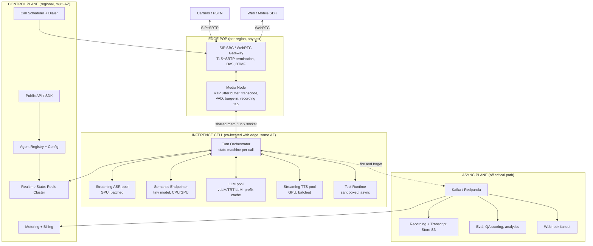

# Voice AI Agent Platform — Architecture

Target: **sub-400ms p50 response latency** at **100,000 concurrent calls**.

The competition (Vapi, Retell, Bland, Bolna, Gnani) is mostly a *glue layer*: they broker
Twilio → Deepgram → OpenAI → ElevenLabs over the public internet. Every hop is a TLS
handshake, a queue, and a cross-region round trip. That architecture floors out around
800ms–1.4s of turn latency and its cost structure is 4 vendor margins stacked.

The thesis of this platform: **own the media path and co-locate the models.** Everything
below follows from that.

---

## 1. Latency budget (the product spec)

Latency is measured from *user stops speaking* → *first agent audio hits their ear*.

| Stage | Naive stack | This platform | How |
|---|---|---|---|
| Packetization + jitter buffer | 60–100 ms | 20–40 ms | 10ms ptime, adaptive 2-frame buffer |
| Network: carrier → media node | 40–120 ms | 10–30 ms | Anycast SIP edge, PoP within 30ms of carrier |
| VAD / endpointing decision | 300–700 ms | 40–120 ms | **Semantic endpointer** (see §4) |
| ASR finalization | 100–300 ms | 0–40 ms | Streaming CTC, transcript already emitted |
| Network: orchestrator → LLM | 50–150 ms | ~0 ms | Same rack, gRPC over RDMA/localhost |
| LLM time-to-first-token | 300–600 ms | 90–180 ms | Prefix cache + speculative prefill (§5) |
| Network: LLM → TTS | 50–150 ms | ~0 ms | Same node, shared memory ring buffer |
| TTS time-to-first-audio | 150–400 ms | 60–110 ms | Streaming vocoder, 1st chunk at ~120ms of audio |
| Encode + RTP out | 20–40 ms | 10–20 ms | Pre-warmed Opus/G.711 encoder |
| **Total (p50)** | **~1,100 ms** | **~320 ms** | |
| **Total (p95)** | ~2,000 ms | **~600 ms** | |

Human turn-taking gap in natural conversation is 200–300ms. Under 400ms the agent stops
*feeling* like software. That is the entire moat — everything else is a feature.

---

## 2. System topology

Two planes, hard-separated. The control plane may fail; calls in flight must not drop.

**Non-negotiable rule:** the orchestrator, ASR, LLM, and TTS for a given call live in the
**same availability zone, ideally the same physical node group**. Every cross-AZ hop on the
audio path costs 1–3ms; every cross-region hop costs 30–90ms; every cross-*cloud* hop (what
Vapi does) costs 80–200ms plus TLS. We spend zero of these on the hot path.

---

## 3. Media layer

### Ingress
- **SIP**: custom SBC on top of `drachtio` + `rtpengine`, or Kamailio for signaling with our
  own Rust media core. Anycast IPs so carriers land in the nearest PoP.
- **WebRTC**: `libwebrtc`/Pion-based gateway (or LiveKit as an accelerator in v1), ICE-lite,
  no TURN relaying for the agent side — we are always public.
- Codecs: G.711 μ/A-law (PSTN reality), Opus (WebRTC/SIP-over-TLS). Transcode once, at the
  media node, into 16kHz mono PCM float internally.

### Media node (Rust)
Single-threaded-per-core, `io_uring`, no GC, no allocation on the packet path.

Per call it owns:
- RTP de/packetization, adaptive jitter buffer (target 2 packets, expands under loss)
- Packet loss concealment, DTMF (RFC2833 + inband)
- **VAD** (Silero-class, 10ms frames, ~0.3ms CPU per frame)
- **Barge-in gate** — the single most important UX component (§4)
- Ring buffer shared with orchestrator via shared memory; **audio never crosses a network
  boundary between media and inference**
- Recording tap → async plane, never blocking

**Density:** ~2,000–3,000 concurrent RTP sessions per 16-core node with G.711, ~1,200 with
Opus transcode. Budget **1,000/node** for safety → 100 media nodes at 100k calls.

**Bandwidth check:** 100k calls × 64kbps × 2 directions ≈ **12.8 Gbps** aggregate. Trivially
spread across 100+ nodes (~130 Mbps each). Bandwidth is not the constraint; GPUs are.

---

## 4. Turn-taking — where competitors actually lose

Everyone gets ASR→LLM→TTS working in a weekend. Nobody gets turn-taking right. This is the
part to over-invest in.

### Semantic endpointing
Fixed silence thresholds (Vapi/Retell default: 500–800ms) force a choice between "the agent
interrupts me mid-sentence" and "the agent feels slow." Both are bad. Replace with a small
(~50–150M param) classifier that consumes **partial transcript + prosody features
(pitch contour, energy slope, final-syllable lengthening) + dialogue state** and emits
`P(turn_complete)` every 20ms.

- `"my account number is four two seven—"` → rising pitch, incomplete numeral → **wait**, even
  after 900ms of silence.
- `"yeah"` → falling pitch, complete backchannel → **respond at 90ms.**
- Adaptive threshold per call: track the caller's own pause distribution and shift the
  decision boundary. Fast talkers get fast agents.

This alone moves p50 by 300–500ms versus a fixed 700ms silence timer, *and* reduces
interruptions. It is the highest-leverage model in the stack.

### Barge-in
- Detected in the **media node**, not the cloud → 20–30ms to stop audio, vs 200ms+ for
  anyone doing it upstream.
- Requires **AEC on the inbound path** so the agent doesn't hear itself (mandatory on
  speakerphone/PSTN echo).
- On barge-in: cancel TTS stream, cancel LLM generation, **truncate the assistant message in
  context to exactly what was actually played out** (byte-accurate from the RTP counter).
  Getting this wrong is why competing agents "forget" they were interrupted.
- Distinguish *interruption* from *backchannel* ("mhm", "yeah", "right") — a classifier on the
  first 300ms. Never stop speaking for a backchannel.

### Filler / latency masking
When predicted response latency > 500ms (tool call, cold cache), emit a natural continuer
("let me check that…") from a pre-rendered, per-agent, per-voice cache. Zero synthesis cost,
covers up to ~2s of tail latency. Must be *semantically gated* — never on a simple yes/no.

---

## 5. Inference pipeline

### Cascade vs. speech-to-speech
Ship **both**, route per-agent:

| | Cascaded (ASR→LLM→TTS) | Native speech-to-speech |
|---|---|---|
| Latency | 300–400ms achievable | 200–300ms |
| Controllability | High — inspect/rewrite text, deterministic tools | Low |
| Cost | ~3 model invocations | 1, but audio tokens are expensive |
| Compliance | Full transcript, redactable | Harder |
| Voice cloning / brand voice | Easy | Constrained to provider voices |

Default = cascaded, because enterprise buyers need transcripts, tool determinism, and PII
redaction. Speech-to-speech as an opt-in mode for consumer/latency-critical agents.

### ASR
- Streaming CTC/Transducer (Parakeet-TDT, Conformer-RNNT class), NOT Whisper — Whisper is
  chunk-based and structurally adds 200ms+.
- Emit partials every 100ms, stable-prefix marking so downstream can act on committed text.
- Continuous batching across calls: pad-free, per-stream state cached on GPU.
- Per-agent **contextual biasing** (product names, SKUs, addresses) injected as a shallow-fusion
  bias list — huge WER win on the words that actually matter for the business.
- Density: **~150–250 concurrent streams per L40S-class GPU.**

### LLM
- Self-hosted 8B–30B on vLLM/TRT-LLM with continuous batching. Frontier models (Claude/GPT)
  available as a routed option for complex agents, but the *fast path* is in-house.
- **Prefix caching keyed by `agent_id`** — the system prompt, tool schemas, and knowledge
  snippets are identical across every call for that agent. This is the difference between a
  4,000-token prefill (~250ms) and a 40-token prefill (~15ms). At scale this is also the
  single largest cost lever.
- **Speculative prefill**: as soon as the endpointer crosses P(complete) > 0.4, start prefilling
  the current partial transcript. If the user keeps talking, discard (cost: a few ms of GPU).
  If they stop, TTFT is already ~90ms because the KV cache is warm. Cuts perceived latency by
  100–200ms for ~8% extra prefill compute.
- Constrained decoding for tool calls (grammar-guided) so tool JSON never needs a retry.
- Token streaming out at clause boundaries → straight into TTS.

### TTS
- Streaming, chunk-wise autoregressive model + fast vocoder. First audio chunk at
  60–110ms after first token arrives.
- Feed on **clause boundaries** (`,` `.` `?` and ~8-token minimum) so prosody stays natural —
  never per-token.
- Per-agent voice embedding cached on GPU.
- **Duty cycle matters:** the agent speaks ~35–40% of a call, so TTS concurrency at 100k calls
  is ~40k active streams, not 100k.
- Density: **~40–80 concurrent streams per L40S.**

### Tool calls
- Run in a sandboxed async runtime; the orchestrator never blocks on them.
- Long tools (>800ms) trigger the filler path and, optionally, a parallel "keep the user warm"
  micro-turn.
- Aggressive per-tool timeouts with a defined fallback utterance. A hung CRM API must never
  hang a phone call.

---

## 6. Capacity model @ 100k concurrent calls

Assumptions: mean turn every 8s of call time; ~90 output tokens per agent turn; agent speaks
38% of wall clock.

| Component | Load | Unit capacity | Nodes/GPUs | Notes |
|---|---|---|---|---|
| SBC / signaling | 100k sessions, ~2k CPS | 15k sessions/node | 8–12 | CPS is the harder limit |
| Media nodes | 100k RTP sessions | 1,000/node | **100–130** | 16-core, network-optimized |
| ASR | 100k streams | 200/GPU | **500–650 GPUs** | largest fixed cost |
| Endpointer | 100k streams | ~2,000/GPU | 50 GPUs | tiny model, or CPU-batched |
| LLM | 12,500 turns/sec | ~300 concurrent decodes/H100 | **120–160 H100** | with prefix cache hit >90% |
| TTS | ~40k active streams | 60/GPU | **650–800 GPUs** | duty-cycle discounted |
| Redis (call state) | 100k keys, ~50k ops/s | — | 6-node cluster/region | ephemeral only |
| Kafka | ~500k events/s | — | 30 brokers | recordings go direct to S3 |

**Reality check:** 12,500 LLM turns/second is roughly an order of magnitude beyond what any
current voice-AI startup serves. 100k concurrent is a ~$40–70M/yr compute footprint. Plan the
architecture for it, but **build for 5k and prove unit economics first** — the design below
scales by adding cells, not by rewriting.

### The cell model
A **cell** = 1 SBC group + ~10 media nodes + its own ASR/LLM/TTS/orchestrator pools,
sized for **5,000 concurrent calls**. Fully self-contained; no cross-cell traffic on the hot
path.

- Scale = add cells. 100k calls = 20 cells across 4–6 regions.
- Blast radius = 5,000 calls, not the platform.
- Deploy canaries per-cell. A bad TTS model version affects 5% of traffic.
- Cells are pinned to a region; a tenant can be pinned to specific cells (compliance,
  data residency, dedicated capacity tiers).
- A global router (anycast + a thin least-loaded-cell service) assigns each new call to a cell
  at INVITE time. After assignment, the call never leaves that cell.

---

## 7. Call state & reliability

- **In-flight state lives in the orchestrator process memory** (fast) with a 200ms-interval
  delta snapshot to Redis (recoverable). Not the other way around — never do a network
  round-trip to fetch conversation state mid-turn.
- Orchestrator crash → media node holds RTP up (call stays alive, audio silent), a sibling
  orchestrator in the same cell restores from the last snapshot in <400ms and resumes. The
  caller hears a pause, not a hangup.
- Media node crash → call drops. Unavoidable without RTP forking; mitigate with node
  drain-before-deploy (media nodes are drained, never restarted with live calls) and the
  cell's failure domain.
- Control plane fully down → **calls in progress continue**, new calls route from a cached
  agent config in each cell. Degraded, not dead.
- Model pool failure → per-component circuit breaker with fallback ladder:
  primary in-house model → secondary in-house → external vendor API (Deepgram/ElevenLabs/
  OpenAI) → graceful hangup with callback promise. The vendor path exists as a *fuse*,
  not as the architecture.

---

## 8. Outbound dialing at scale

Different problem from inbound; this is where campaign platforms fall over.

- **Rate-limited dispatcher** per carrier trunk, per DID, per destination country. Carriers
  will block you for CPS spikes long before you hit their capacity.
- Token-bucket per (trunk, region) with backpressure into the campaign queue.
- **Answering machine detection (AMD)** in the media node using audio + a small classifier —
  target <1.2s decision, since every second of AMD is a second of dead air on a human answer.
  Beep detection for voicemail drops.
- Compliance engine on the critical path: DNC lists, per-jurisdiction calling windows
  (TCPA/local time zone), consent records, per-number attempt caps. Enforced at dispatch,
  logged immutably.
- Retry policy with exponential backoff and per-lead attempt state; campaign pacing that
  adapts to live agent-availability if there's a transfer target.

---

## 9. Platform surface (what customers touch)

- **Agent definition as versioned config**: prompt, voice, tools, knowledge, guardrails,
  endpointing profile. Immutable versions; every call records the exact version → reproducible
  debugging.
- **SDKs**: TypeScript, Python, plus a WebRTC client SDK for web/mobile.
- **Realtime WS API** for a "bring your own brain" mode — customer's server drives the
  conversation, we own media + ASR + TTS + turn-taking. This wins the customers who won't
  give up their agent logic, and it's the highest-margin product.
- **Tool/function calling** over HTTP webhooks + native connectors (Salesforce, HubSpot,
  Twilio, Calendly, Zendesk, custom SQL).
- **Warm transfer to human** with full conversation summary injected into the agent's screen —
  SIP REFER for cold, conference-bridge for warm.
- **Simulation & eval harness**: replay real call audio against a new agent version, score with
  an LLM judge on task completion, latency, interruption rate, hallucination. **CI for agents.**
  This is a genuinely underserved gap in the market — nobody can currently answer "will this
  prompt change break my agent?"
- **Observability per call**: waterfall of every stage's latency, ASR partials, LLM tokens,
  tool timings, audio waveform with barge-in markers. Ship it to customers, not just internal.

---

## 10. Security, compliance, cost

- SRTP/DTLS on all media; TLS 1.3 signaling. Per-tenant KMS keys for recordings.
- **Streaming PII redaction** — detect and mask card numbers/SSNs in the ASR partial stream
  before it hits the LLM or storage. PCI DSS and HIPAA BAA are table stakes for enterprise;
  design for them at v1 rather than retrofitting.
- Data residency by cell pinning (EU cells never egress).
- Prompt-injection defense: caller speech is untrusted input. Tool-call authorization is
  evaluated against the agent's declared policy, not against what the model asked for.
- **Cost per minute target:** self-hosted cascade at scale lands around **$0.02–0.04/min** of
  compute (ASR ~$0.006, LLM ~$0.008, TTS ~$0.012, media ~$0.002) plus $0.005–0.01 telephony.
  Vapi-style resellers pay $0.09–0.15/min in vendor fees. That gap is the business model:
  match their price at 3× the margin, or undercut by half and take the market.

---

## 11. Build sequence

**Phase 1 — prove the latency claim (8–10 weeks).** Single region, single cell, 500 concurrent
calls. Rust media node + orchestrator, vendor APIs for ASR/LLM/TTS initially. Ship the
semantic endpointer and barge-in — those are yours from day one and they're the demo.
Success metric: **p50 < 500ms, demonstrably better than a side-by-side Vapi agent.**

**Phase 2 — bring inference in-house (10–14 weeks).** Self-host ASR and TTS in-cell. Prefix
caching + speculative prefill on a self-hosted LLM. Target p50 < 350ms and cost/min < $0.05.
Vendors demoted to fallback fuse.

**Phase 3 — platform (12 weeks).** Cell abstraction, multi-region, control plane, dashboards,
eval/simulation harness, outbound dialer + compliance. Scale to 10k concurrent.

**Phase 4 — scale out.** Cells are additive. 10k → 100k is a capacity and cost problem, not
an architecture problem, which is exactly the property this design is buying you.

---

## 12. Recommended stack

| Layer | Choice | Why |
|---|---|---|
| Media node / orchestrator | **Rust** (tokio, io_uring) | no GC pauses on a 10ms audio deadline |
| SIP signaling | Kamailio or drachtio | battle-tested, don't write this |
| WebRTC | Pion / libwebrtc (LiveKit in v1) | accelerate, replace if it becomes the bottleneck |
| LLM serving | vLLM → TensorRT-LLM | prefix caching + continuous batching |
| ASR | Parakeet-TDT / Conformer-RNNT | true streaming, not chunked |
| TTS | streaming AR + fast vocoder | first chunk < 110ms |
| Control plane | Go or TypeScript, Postgres | boring on purpose |
| State | Redis Cluster (ephemeral only) | never the source of truth mid-turn |
| Events | Redpanda | Kafka API, lower operational tax |
| Orchestration | Kubernetes + Karpenter; **bare metal for GPU** | GPU on cloud VMs at this scale is a margin killer |
| Observability | OpenTelemetry, per-call trace as first-class product | |

---

## The short version

1. **Own the media path.** Barge-in and endpointing decisions happen 20ms from the caller, not
   200ms away in someone else's cloud.
2. **Co-locate every model with the orchestrator.** Delete 300ms of pure network tax that every
   competitor pays on every turn.
3. **Semantic endpointing, not silence timers.** This is the single biggest perceived-latency
   win and the hardest thing to copy.
4. **Speculative prefill + per-agent prefix cache.** Latency *and* cost, from the same trick.
5. **Cells of 5k calls.** Scale by replication, cap blast radius, sell dedicated capacity.
6. **Self-hosted inference.** 3× margin over the resell model — that's what funds the rest.
