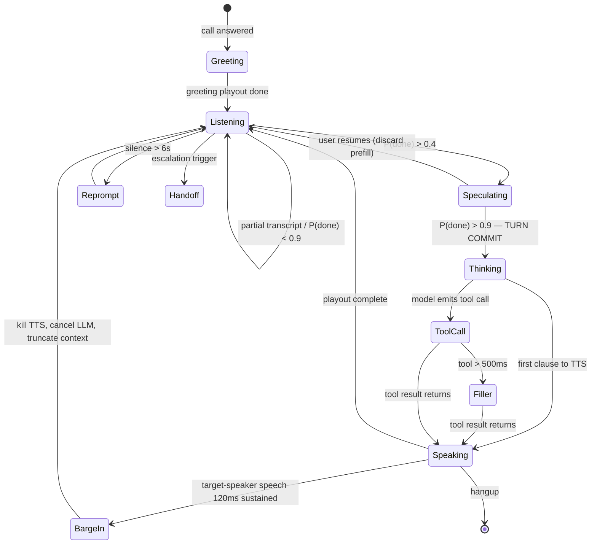

# How a Turn Actually Works

> "if user speaks then we have STT → LLM → TTS, it is like this?"

**Yes as a chain of components. No as a sequence of steps.**

That distinction is the whole ballgame. If you build it as three sequential request/response
calls — wait for full transcript, send to LLM, wait for full reply, send to TTS, wait for full
audio — you get **1.2–2 seconds** and you have rebuilt Vapi.

Everything runs **concurrently and streams into the next stage**. Nothing waits for the
previous stage to *finish*. The pipeline is a set of always-running processes connected by
ring buffers, not a series of API calls.

---

## The naive version (what NOT to build)

```
User speaks ────────────► [silence] ──► STT ──► LLM ──► TTS ──► Agent speaks
                            700ms      300ms   600ms   400ms
                          └──────────────── 2000 ms ────────────────┘
```
Each box starts only when the previous one ends. Four sequential waits.

## The real version

```
User speaks ──────────────────────────────┐
   │                                       │
   ├─ VAD          (running, every 10ms)   │
   ├─ Denoise/AEC  (running, every 10ms)   │
   ├─ STT          (running, partials every 100ms) ──┐
   ├─ Endpointer   (running, P(done) every 20ms) ────┤
   │                                                  │
   │                        ┌─────────────────────────┘
   │                        ▼
   │                  speculative prefill starts BEFORE user finishes
   │                        │
   └─ user stops ───────────┤
                            ▼
                     LLM decodes ──stream──► TTS synthesizes ──stream──► RTP out
                            └──────── all three run at the same time ────────┘
```

---

## Concrete timeline — one turn

Caller says *"Hi, I want to check my order status"* (2.5 seconds of speech).

| Time | What's happening | Which component |
|---|---|---|
| **t=0** | Caller starts speaking. 20ms RTP packets begin arriving. | Media node |
| t=0→2500 | **Every 10ms:** de-jitter → AEC → denoise → VAD → target-speaker check. Continuous. | Acoustic frontend |
| t=0→2500 | **Every 100ms:** STT emits a partial. At t=900ms it already has `"hi i want to"`. STT is *never idle waiting* — it transcribes as audio arrives. | ASR pool |
| t=0→2500 | **Every 20ms:** endpointer scores `P(turn_complete)` from partial text + pitch contour + energy slope. | Endpointer |
| **t=2300** | Endpointer crosses **0.4**. Caller is *probably* finishing. → **Speculative prefill fires.** LLM builds the KV cache for the context now, in the background. Agent prompt + tools are already cached by `agent_id`, so this is only the new tokens. | LLM pool |
| **t=2500** | Last audio frame of speech. | Media node |
| **t=2590** | Endpointer crosses **0.9** (falling pitch + syntactically complete). → **TURN COMMITTED.** *90ms after they stopped — not 700.* | Endpointer |
| t=2595 | STT stabilizes the final transcript. **~0ms cost** — it was already transcribed, we just mark it final. | ASR |
| **t=2600** | LLM starts **decoding**. Prefill is already done (t=2300), so TTFT ≈ 90ms instead of 250ms. | LLM |
| **t=2690** | First tokens out: `"Sure,"` | LLM |
| **t=2730** | Clause boundary hit (`,` + ≥8 tokens) → text pushed to TTS. **We do not wait for the sentence to finish.** | Orchestrator |
| t=2730 | Normalization pass on that chunk (strip markdown, verbalize numbers/dates). ~2ms. | Normalizer |
| **t=2810** | TTS emits its first audio chunk (~120ms of speech). | TTS pool |
| t=2820 | Opus/G.711 encode + packetize. | Media node |
| **t=2870** | **First audio in the caller's ear.** | — |
| t=2870→ | LLM is *still decoding*. TTS is *still synthesizing*. RTP is *still sending*. All three simultaneously, pipelined, until the reply ends. | All |

**Latency = 2870 − 2500 = 370ms.**

Note where the time actually went: **90ms endpointing + 90ms TTFT + 80ms TTS + 60ms network/encode.**
STT contributed ~0. That surprises people — but streaming STT does its work *during* the
caller's speech, so it costs nothing at turn boundaries. The expensive parts are the ones you
can't overlap: deciding they're done, and generating the first sound.

---

## Why it's not "STT finishes → LLM starts"

Three overlaps do all the work:

**1. STT overlaps the caller.** By the time they stop talking, the transcript already exists.
A chunked model like Whisper *cannot* do this — it needs a complete audio window, which is why
it structurally adds 200ms+. Use a streaming transducer (Parakeet-TDT / Conformer-RNNT).

**2. LLM prefill overlaps the end of the caller's speech.** At `P(complete) > 0.4` we prefill
on the partial transcript. If they keep talking, we throw it away — costs a few ms of GPU. If
they stop, we've already paid the prefill cost. ~8% extra compute for 100–200ms of latency.

**3. TTS overlaps LLM decoding.** We feed TTS at clause boundaries, not at end-of-reply. The
agent starts speaking word 3 while the LLM is generating word 40. For a 4-second reply, this
hides ~3.5 seconds.

Together these three collapse ~1,100ms of sequential work into ~370ms of wall clock.

---

## The full state machine



---

## Branch: tool call

When the model needs data (order lookup, calendar, CRM):

```
t=2690  LLM emits tool_call(get_order, id=...)   ← grammar-constrained, always valid JSON
t=2700  Tool dispatched, async. Orchestrator does NOT block.
t=2700  Latency predictor: this tool's p50 is 900ms → exceeds 500ms threshold
t=2710  Filler path fires: pre-rendered "Let me pull that up for you"
        ← zero synthesis cost, cached per agent per voice
t=2830  Filler audio in caller's ear (still ~330ms — they hear something fast)
t=3600  Tool returns
t=3610  Result appended to context, LLM resumes decoding
t=3700  TTS: "Okay, order 4-2-7-3 shipped Tuesday, arriving Thursday"
```

The caller never experiences dead air. Without the filler they'd sit in silence for ~1.2s,
which on a phone call feels like the line dropped.

Tool rules: hard timeout with a defined fallback utterance, results validated against a
schema before entering context, and a hung CRM API can never hang a phone call.

---

## Branch: barge-in (caller interrupts)

The hardest path to get right, and where most platforms visibly fail.

```
Agent is speaking. Caller starts talking at t=5000.

t=5000  Speech energy detected
t=5005  AEC confirms it isn't our own playout echoing back
t=5010  Target-speaker check: is this the enrolled caller, or the TV?
        → background noise / other voices are REJECTED here
t=5010  Backchannel classifier: is this "mhm"/"right"? → if yes, KEEP TALKING
t=5120  120ms of sustained target-speaker speech → BARGE-IN CONFIRMED
t=5125  Kill TTS stream. Stop RTP playout. Cancel LLM generation.
t=5130  Read the RTP playout counter: exactly 3.2s of audio was actually heard.
        Truncate the assistant message in context to those words ONLY.
t=5130  State → Listening. STT is already transcribing the interruption.
```

**Step t=5130 is the one everyone gets wrong.** If you keep the full generated reply in
context, the agent believes it said things the caller never heard — so it won't repeat them,
and the conversation desyncs. That's the root cause of "the agent forgot what it was saying
after I interrupted." It's a bookkeeping bug, not a model quality problem.

Total stop time: **~130ms**, because all of it happens in the media node. A platform that
detects barge-in in the cloud pays 200–400ms — long enough for the caller to say "I said
NO" over the top of the agent.

---

## The alternative: speech-to-speech

One model, audio in → audio out. No STT/TTS boundary.

```
Audio ──► [ single multimodal model ] ──► Audio
              200–300ms
```

**Faster** (one model instead of three) and **better prosody** (it hears tone, not just words).
**But:** you can't inspect or rewrite the text mid-flight, tool calls are less reliable, you're
locked to the provider's voices, and PII redaction/compliance is much harder.

Ship both. **Default to cascaded** — enterprise buyers need transcripts, deterministic tools,
and redaction. Offer speech-to-speech as an opt-in mode where latency beats control.

---

## The one-sentence answer

STT → LLM → TTS is the right chain, but all three run **at the same time**, streaming into
each other, with STT already finished before the caller stops and the LLM's prefill already
warm — so the only latency you actually pay is *deciding the caller is done* (90ms),
*first token* (90ms), and *first audio* (80ms).
