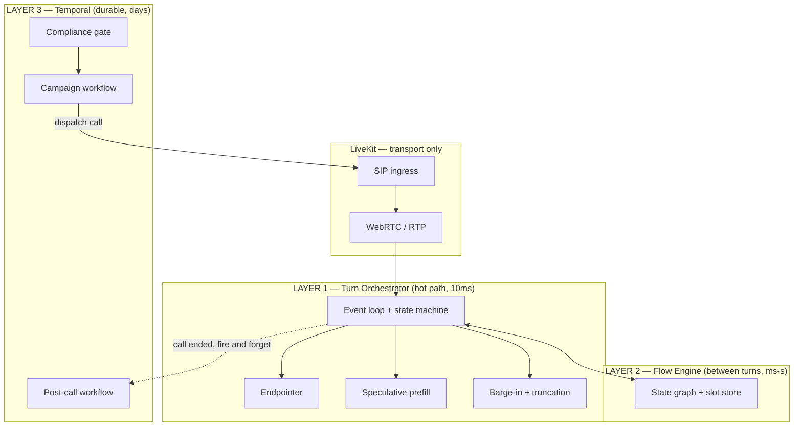

# Orchestration — What to Use

> "since we're using LiveKit + own orchestrator, is there some service for orchestrating?"

Yes — but "orchestration" means three different things here, at three different timescales,
and they have three different answers. Conflating them is a common and expensive mistake.

| Layer | Timescale | Question it answers | Verdict |
|---|---|---|---|
| **1. Turn orchestration** | 10ms–1s | "Is the caller done? What do we say? Stop talking?" | 🔒 **BUILD** — no service does this well. It's the moat. |
| **2. Dialogue / flow management** | seconds–minutes | "What step of the conversation are we in? What slots are filled?" | **BUILD** — but a small, boring state machine, not a framework |
| **3. Call & campaign orchestration** | minutes–days | "Dial these 50k leads, retry failures, respect windows, run the post-call workflow" | ✅ **BUY** — Temporal |

Most teams reach for a workflow engine for layer 1 (catastrophic — 10ms budget, not 100ms) or
hand-roll layer 3 (catastrophic in a different way — you rebuild durable execution badly).

---

## Layer 1 — Turn orchestration

### Start here: LiveKit Agents

It ships with LiveKit and gives you, out of the box:

- **`AgentSession`** — the run loop wiring STT → LLM → TTS with interruption handling
- **Plugins** for Deepgram, AssemblyAI, OpenAI, Anthropic, Cartesia, ElevenLabs, Silero VAD
- **A semantic turn-detection model** (`livekit-plugins-turn-detector`) — open weights, runs
  locally, classifies turn-completion from transcript text
- **Worker/job model** — a worker pool that gets dispatched a job per room, autoscales
- Function calling, metrics, transcription forwarding

That turn-detector plugin matters: it's an existing, working implementation of the exact idea
in `ARCHITECTURE.md` §4. Use it as your **baseline**. Your differentiator is beating it by
adding **prosody** (pitch contour, energy slope, final-syllable lengthening) and **per-caller
adaptation** — theirs is text-only, so it can't tell a rising `"four two seven—"` from a
falling one. That's a real, measurable delta, and having their model as a benchmark is a gift.

> API surface moves fast — check current LiveKit Agents docs before wiring; names here reflect
> the general shape, not a pinned version.

### Then: progressively hollow it out

Don't fork on day one and don't commit forever. Replace one component at a time behind stable
interfaces:

| Step | What you swap | Why | When |
|---|---|---|---|
| **1a** | Nothing — vanilla `AgentSession` + vendor plugins | Working agent in days. Establishes the baseline number. | Week 1–2 |
| **1b** | Their turn detector → **ours** (text + prosody + adaptive) | First real latency win, ~200–400ms | Week 3–6 |
| **1c** | Their LLM node → **ours** (speculative prefill, cancellation, prefix cache keys) | Second latency win, ~100–200ms | Week 6–9 |
| **1d** | Their interruption path → **ours** in the audio frame callback (target-speaker VAD, playout-accurate truncation) | Barge-in quality — the visible one | Week 8–12 |
| **2** | Everything. LiveKit becomes **transport only**; our Rust orchestrator consumes tracks directly | Sub-350ms, 100k scale | Month 4+ |

By step 2 you've kept LiveKit for exactly what it's good at (ICE/NAT/SIP/RTP) and own every
millisecond that matters. Each step is independently shippable and independently measurable —
that's the point of doing it this way rather than a big-bang rewrite.

### What you're building at layer 1

The turn orchestrator is a **single-threaded event loop per call** over one state machine:

```
events in:  audio_frame(20ms) | asr_partial | asr_final | endpoint_score
            | llm_token | llm_done | tts_chunk | tts_done | playout_progress
            | tool_result | dtmf | hangup

state:      GREETING | LISTENING | SPECULATING | THINKING | TOOL_CALL
            | FILLER | SPEAKING | BARGE_IN | HOLD | HANDOFF

invariants: - exactly one of {LLM generating, TTS synthesizing} may be cancelled at any time
            - context.assistant_last is ALWAYS truncated to playout_counter
            - no blocking call may exceed 30ms on this loop
```

That's a few thousand lines, not a framework. It should stay small enough to hold in your head,
because every latency bug you will ever have lives in it.

### Explicitly do NOT use for layer 1

- **Temporal / Restate / Airflow** — durable workflow engines. Persistence per state transition
  costs 5–50ms. You have 10ms. Wrong tool, right building.
- **LangChain / LlamaIndex** — batch-oriented, retry-happy, opaque latency. Fine for the
  knowledge/RAG service off the hot path; never in the turn loop.
- **A message bus (Kafka/NATS) between STT/LLM/TTS** — tempting for "clean architecture," adds
  2–15ms per hop plus serialization. These components share a process and a ring buffer.

---

## Layer 2 — Dialogue / flow management

This is the Hybrid Flow Engine from `PROBLEM-COVERAGE.md` §F: a directed graph of states, each
with entry conditions, required slots, allowed tools, and exit conditions. LLM handles
*language* within a state; the engine owns *transitions*.

**Build it.** It's a graph interpreter over a JSON config — maybe 1,500 lines. The alternatives
are all wrong for this shape:

- **Rasa** — designed for intent/entity NLU-based dialogue, predates LLMs, heavy
- **Dialogflow CX** — Google lock-in, its own runtime, can't co-locate with your models
- **Pure prompting** — what competitors do; drifts on long calls, unauditable, fails enterprise review
- **XState** — a genuinely good state machine library if you want one in TS. Reasonable to
  borrow the semantics; don't take a dependency in the hot path.

The key design point: the flow engine runs **between** turns, not during them. It sets up the
LLM's context for the next turn (which tools are allowed, which slots to fill) and consumes the
result. It's never in the millisecond path.

---

## Layer 3 — Call & campaign orchestration

**Use Temporal.** This is exactly what it's for and it's where hand-rolling hurts most.

What lives here:

- **Outbound campaigns** — 50k leads, dial pacing, retry with backoff, per-lead attempt state
- **Compliance gates** — DNC check, calling-window check, consent verification before dispatch
- **Post-call workflows** — transcribe → score → extract → CRM write → webhook → billing
- **Multi-call journeys** — call, no answer, SMS, retry tomorrow, escalate to human
- **Scheduled callbacks**

Why Temporal specifically: these workflows run for **days**, must survive deploys and crashes,
and need exactly-once semantics on side effects (never double-dial a lead, never double-charge).
Durable execution gives you that for free. Building it on cron + a database table is a
well-known path to a very bad quarter.

```python
@workflow.defn
class OutboundCampaign:
    async def run(self, campaign: Campaign):
        async for lead in self.paced(campaign.leads, cps=campaign.cps):
            if not await workflow.execute_activity(compliance_check, lead):
                continue
            result = await workflow.execute_child_workflow(SingleCall, lead)
            if result.no_answer and lead.attempts < 3:
                await workflow.sleep(next_window(lead))   # survives deploys
                await workflow.continue_as_new(...)
```

Alternatives: **Restate** (lighter, newer, good if Temporal's ops burden bites), **Inngest**
(hosted, fastest to start, less control). Temporal is the safe pick — the ops cost is real but
the failure modes are known.

---

## Putting it together



**Three rules:**
1. Layer 3 **never** blocks layer 1. It starts calls and consumes their results; it is never
   in the loop.
2. Layer 2 runs **between** turns, never during one.
3. Layer 1 has **no network hops** to anything except the model servers, and those are in the
   same rack.

---

## Concrete Phase 1 answer

```
Temporal                    ← buy: campaigns, retries, post-call workflows
   ↓ dispatches
LiveKit Agents worker       ← buy: job model, transport, plugin glue
   └─ AgentSession
        ├─ turn detector    ← START with theirs, REPLACE by week 6
        ├─ STT plugin       ← Deepgram
        ├─ LLM node         ← REPLACE by week 9 (speculative prefill)
        ├─ TTS plugin       ← Cartesia
        └─ flow engine      ← BUILD, ours from day one
   ↓
LiveKit SIP + SFU           ← buy: Go media plane
```

You can have this running end-to-end in about two weeks, and every piece marked REPLACE has a
clear, independently-measurable reason to exist.

**The summary:** LiveKit Agents is the orchestration service, and it's a good one — use it as
scaffolding and a benchmark, not as the destination. Temporal is the orchestration service for
everything that isn't the hot path, and you should use it permanently. There is no service for
the turn loop itself, and that's fine, because that's the part you're supposed to own.
